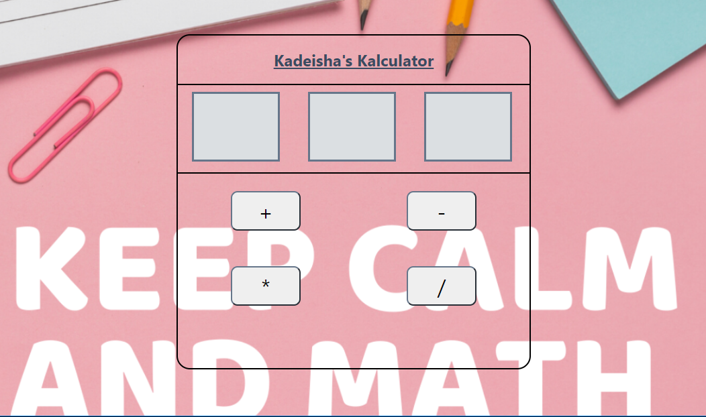

# Calculator
Welcome to my simple calculator. Input two numbers, add, subtract, multiply, or divide them to get an accurate result.
## **Link to project:** https://kr-calculator.netlify.app/

## How It's Made:
**Tech used:** HTML, CSS, JavaScript

## Lessons Learned:
Still brand new to JavaScript, it was a little challenging getting over the initial hump of doing the calculator. After doing some reviews and getting more comfortable with loops, I became more comfortable and was able to crank out the rest of the code for my calculator.
